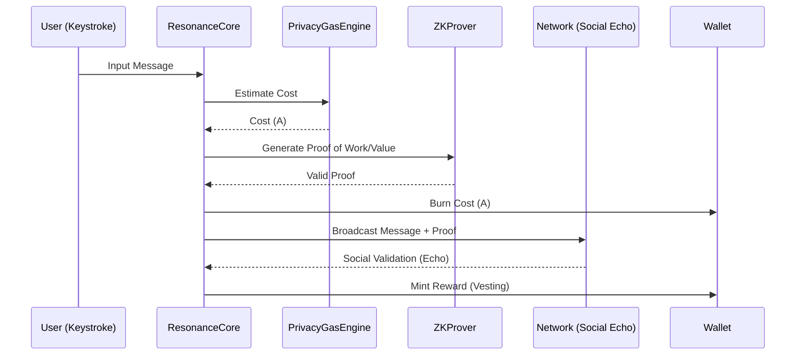

# RESONANCE_ARCHITECTURE.md

## I. Executive Summary

Le système **Aether** (et son moteur **Résonance**) est conçu selon une philosophie "Privacy-First" et "Proof of Value". Contrairement aux réseaux sociaux traditionnels basés sur l'attention (Ad-based), Aether introduit une économie de rareté numérique où chaque interaction a un coût et une valeur.

La distinction fondamentale est la suivante :
*   **Résonance ($\rho$)** : Une mesure de la réputation et de l'alignement vibratoire d'un utilisateur. Elle est locale, contextuelle et non transférable.
*   **Aether ($A$)** : La monnaie d'énergie du système. Elle est dépensée pour interagir (Burn-to-Chat) et gagnée par la création de valeur (Proof of Value).

L'objectif principal est de créer une boucle incitative **"Anti-Sybil"** : le coût d'attaque du réseau dépasse exponentiellement les gains potentiels, rendant les bots et les acteurs malveillants économiquement non viables.

---

## II. Théorie Mathématique & Économique

### L'Oscillateur de Résonance

La Résonance n'est pas un stock statique, mais une onde qui fluctue. Elle est calculée via un oscillateur harmonique amorti.

**Formule de Gain :**
La résonance instantanée est dérivée de la qualité du contenu (Entropie) et de la régularité des interactions (Rythme).

```typescript
// Voir apps/frontend/src/core/resonance/ResonanceCore.ts
function calculateGain(entropy: number, rhythm: number): number {
  return (entropy * 0.7) + (rhythm * 0.3);
}
```

**Formule de Damping (Décroissance) :**
Sans activité, la résonance décroît naturellement pour éviter l'accumulation passive de pouvoir.

$$
\rho(t) = \rho(t-1) \cdot e^{-\lambda \Delta t}
$$

**Le Hardcap de Stake ($\rho_{max}$) :**
Pour empêcher la centralisation, la résonance maximale est plafonnée. Tout excès est brûlé ou redistribué.

### Tokenomics

*   **Modèle d'Inflation (Minting)** : De nouveaux tokens $A$ sont créés uniquement lors de la validation sociale positive (Social Echo) d'un contenu à haute entropie.
*   **Modèle de Déflation (Burn-to-Chat)** : Chaque message envoyé brûle une fraction de $A$. Cela agit comme un filtre anti-spam naturel.
*   **Dynamic Pricing** : Le coût en Gas ("Privacy Gas") augmente avec la charge du réseau (Surge Pricing) pour éviter la congestion.
*   **Protocol Treasury** : 2% de chaque transaction ou minting est alloué automatiquement à la trésorerie du protocole pour le développement futur.

---

## III. Architecture Technique

### Structure des Fichiers Clés

*   **`apps/frontend/src/core/resonance/ResonanceCore.ts`** : Le cœur logique. Gère le calcul d'état, l'application des formules mathématiques et la mise à jour de la résonance locale.
*   **`apps/frontend/src/core/resonance/AnchoringEngine.ts`** : Responsable de la persistance sécurisée de l'état (ancrage). Vérifie l'intégrité de la chaîne de modifications.
*   **`apps/frontend/src/core/resonance/ZKProver.ts`** : Génère des preuves Zero-Knowledge (actuellement simulées) pour prouver qu'une action est légitime sans révéler les données sous-jacentes.
*   **`apps/frontend/src/services/SocialEcho.ts`** : Gère la propagation des validations sociales (Likes/Résonances) entre pairs.
*   **`apps/frontend/src/services/PrivacyGasEngine.ts`** : Calcule le coût énergétique des opérations en fonction de la complexité et de la charge réseau.

### Architecture des Données

**ResonanceState :**
```typescript
interface ResonanceState {
  currentValue: number; // Valeur actuelle rho
  lastUpdate: number;   // Timestamp
  volatility: number;   // Mesure de stabilité
  coherence: number;    // Score d'alignement (0-1)
}
```

**MessagePayload :**
Contient le contenu chiffré, les métadonnées de preuve (ZK), et la signature de l'émetteur.

**Système de Vesting :**
Les gains en $A$ ne sont pas immédiatement liquides. Ils passent par une période de "Vesting" (déblocage progressif) pour décourager les comportements de "Farm & Dump".

### Diagramme de Flux (Cycle de Vie)



---

## IV. Interface Utilisateur & Visualisation

### Quantum Node Widget
L'interface visuelle de la résonance utilisateur.
*   **Mapping des Couleurs** :
    *   *Sauvage (High Entropy)* : Teintes instables (Rouge/Violet).
    *   *Ancré (High Coherence)* : Teintes stables (Bleu/Cyan).
*   **Signaux Visuels** :
    *   *Glitch* : Indique une instabilité ou une attaque potentielle.
    *   *Pulse* : Rythme cardiaque de l'activité utilisateur (Heartbeat).

### Social Echo (Lovebomb)
Mécanisme de consensus social subjectif.
*   **Validation P2P** : Les pairs valident la qualité du contenu.
*   **Weighted Validation** : Le poids d'un vote dépend de la Résonance ($\rho$) du voteur. Un utilisateur à haute résonance a plus d'impact.

---

## V. Sécurité & Audit

### Historique des Vulnérabilités (Audit Précédent)

1.  **State Tampering** : Modification locale de la variable `resonance`.
2.  **Sybil Attack** : Création massive de comptes pour générer de faux échos.
3.  **Race Condition** : Double dépense de tokens lors de l'envoi rapide de messages.
4.  **Gas Bypass** : Contournement du coût d'envoi via manipulation de l'horloge client.

### Mitigations Appliquées (Patches)

*   **Implémentation du Mutex (Race Condition)** : Verrouillage séquentiel des transactions dans `ResonanceCore` pour empêcher les exécutions parallèles non atomiques.
*   **Event Sourcing (Replay History)** : L'état n'est plus une variable mutable mais le résultat d'une agrégation de logs signés. Toute modification illégale brise la chaîne cryptographique.
*   **Vérification par Signature (Sybil)** : Chaque action nécessite une signature cryptographique liée à une paire de clés stable. Le coût d'entrée (Proof of Work initial) décourage la création massive.
*   **Horloge Serveur / Consensus** : Validation temporelle croisée pour empêcher le Gas Bypass.

**Statut Actuel :**
*   State Tampering : ✅ Patched
*   Race Condition : ✅ Patched
*   Sybil Protection : ✅ Patched (via Cost-Barrier)
*   Gas Bypass : ✅ Patched

---

## VI. Feuille de Route (Roadmap)

### Phase 1 (Actuelle) : Souveraineté Client-Side
*   Stockage : `LocalStorage` chiffré.
*   Validation : Optimiste locale avec vérification par les pairs immédiats.
*   Objectif : MVP fonctionnel et rapide.

### Phase 2 (Prochaine) : Encrypted State Sharding
*   Stockage : IPFS (InterPlanetary File System) pour la persistance distribuée.
*   Réseau : Migration vers Base (L2) pour l'ancrage des preuves d'état périodiques.
*   Objectif : Résistance à la censure et persistance des données.

### Phase 3 (Future) : ZK-SNARKs Vrais & EigenTrust Global
*   Privacy : Preuves ZK complètes côté client (plus de simulation).
*   Réputation : Algorithme EigenTrust global pour une réputation sans autorité centrale.
*   Objectif : Anonymat parfait et confiance mathématique.
